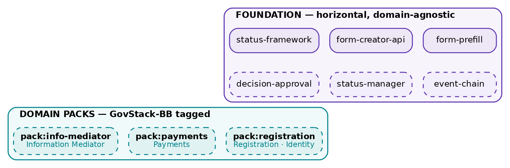

# joget-platform-plugins

Reusable, project-neutral **Joget DX OSGi plugins**, published as versioned artifacts and
consumed by projects — and by [`joget-spec-kit`](https://github.com/aarelaponin/joget-spec-kit) —
by **version pin, never by copy**. These are extensions of the Joget development platform,
not components of any one project.

This is the shared runtime-extension library for **any spec-to-code-on-Joget development** —
it is not GovStack-specific. Plugins are organised by capability: **foundation** (horizontal,
domain-agnostic) and **domain packs** (`pack:<domain>`). GovStack Building Blocks are an optional
tagging vocabulary on the packs that align to one, not the organising axis. See
`docs/CONSOLIDATION-PLAN.md` for the taxonomy and roadmap.

## The invariant

> **A plugin here NEVER depends on a consuming project.**

Projects (and the kit) depend on these plugins; the arrow only points one way. The moment a
plugin imports project code, it is disqualified — it goes back into the project until it is
genericised. This is the same one-way dependency rule that protects `joget-spec-kit`, applied
to the runtime layer. It is what turns reuse into *pin a version* instead of *copy and diverge*.

## Repo shape

```
pom.xml                     # parent (multi-module reactor; shared versions; GH Packages dist)
registry.yaml               # single source of truth: every plugin + its config contract
docs/
  registry.schema.yaml      # schema for registry entries
  CONSOLIDATION-PLAN.md     # THE program plan: phases, status, roadmap, decisions
  MIGRATION-BACKLOG.md      # what moves here, in what order, with provenance rules
  DAS-EXTRACTION-PLAN.md    # how the trapped approval service comes out of cmbb-plugins
plugins/
  joget-form-prefill/       # module 1 (active) — config-only form prefill binder
  ...                       # further modules as promoted
```

## Consume a plugin (from a project or the kit)

Pin the artifact; do not vendor the JAR:

```xml
<dependency>
  <groupId>com.fiscaladmin.joget</groupId>
  <artifactId>joget-form-prefill</artifactId>
  <version>1.0.0</version>
  <scope>provided</scope>   <!-- deployed to the instance, not embedded in the app -->
</dependency>
```

At deploy time the pinned JAR is dropped into `<joget>/wflow/app_plugins/` (hot-reload ~10s)
or uploaded via Manage Plugins. `joget-spec-kit`'s `deploy` step resolves the pins and does
this; it reads `registry.yaml` to know which plugins exist and how to configure them.

## Build & publish

Builds run on a workstation with JDK + Maven (the Cowork sandbox has no Maven).

```bash
mvn -q -pl plugins/<module> -am clean install     # build + test + install to ~/.m2 (local proof)
mvn -q -pl plugins/<module> -am deploy             # publish to GitHub Packages (needs a token)
```

Publishing to **GitHub Packages** needs a Personal Access Token (`write:packages`) in
`~/.m2/settings.xml` under server id `github`. Credentials live there, never in this repo.

## Versioning & the config contract

Semver per plugin. A plugin's **config contract** (the property/element keys in its
`registry.yaml` entry) is its public API — the surface `joget-spec-kit` generates against
*without compiling the plugin*. Changing a contract key is a **major** bump; adding an
optional one is minor; a bug fix is a patch. `dx_compat` records DX 8.x / 9.x support.

## Governance (so it does not rot back into duplication)

- **One home.** A plugin lives here and only here. Projects pin it; they never fork or vendor it.
- **Promote, don't copy.** When a second project needs a plugin, promote it here and pin — never
  paste it into the second project.
- **Provenance scrub before promotion.** No client names (see MIGRATION-BACKLOG §Provenance) in
  shipped code, comments, samples or resources. Test fixtures may use domain-generic field names.
- **Registry ↔ build drift check.** CI asserts every `status: active` entry maps to a built
  module and vice-versa (the `joget-claude-skills` MANIFEST drift is the cautionary tale).

## Relationship to the other repos

```
joget-claude-skills   → the authoring method (how a human/agent builds)
joget-spec-kit (jkit) → the how-to-build engine (spec → artefacts); reads registry.yaml
joget-platform-plugins→ THIS repo — the runtime extensions (the JARs Joget loads)
project repos         → depend on all three by version pin; own only their app model + assets
```

## Documentation & vision

Start with the **[Vision](docs/VISION.md)** — why plugins become a platform, what it is, and how
it works, with diagrams. The [`docs/`](docs/) folder is the home for all canonical documents
(Markdown, rendered on GitHub with figures); see [docs/README.md](docs/README.md) for the index and
the convention (polished DOCX/PDF are published as GitHub Release assets, not committed).



*Foundation (horizontal) + Domain packs (GovStack-BB tagged). Solid = shipped; dashed = planned.*
