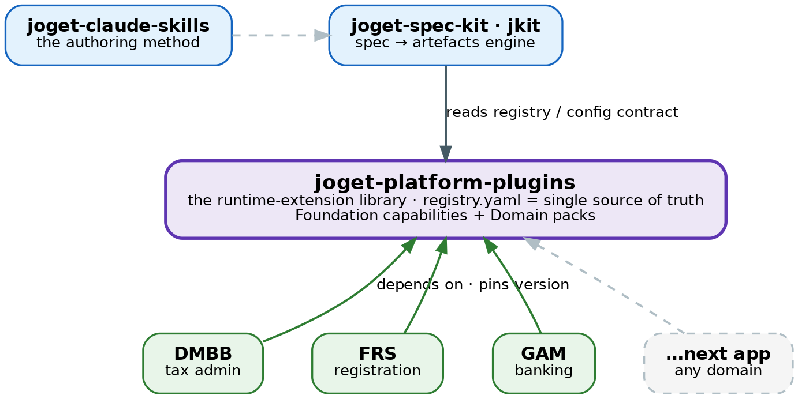
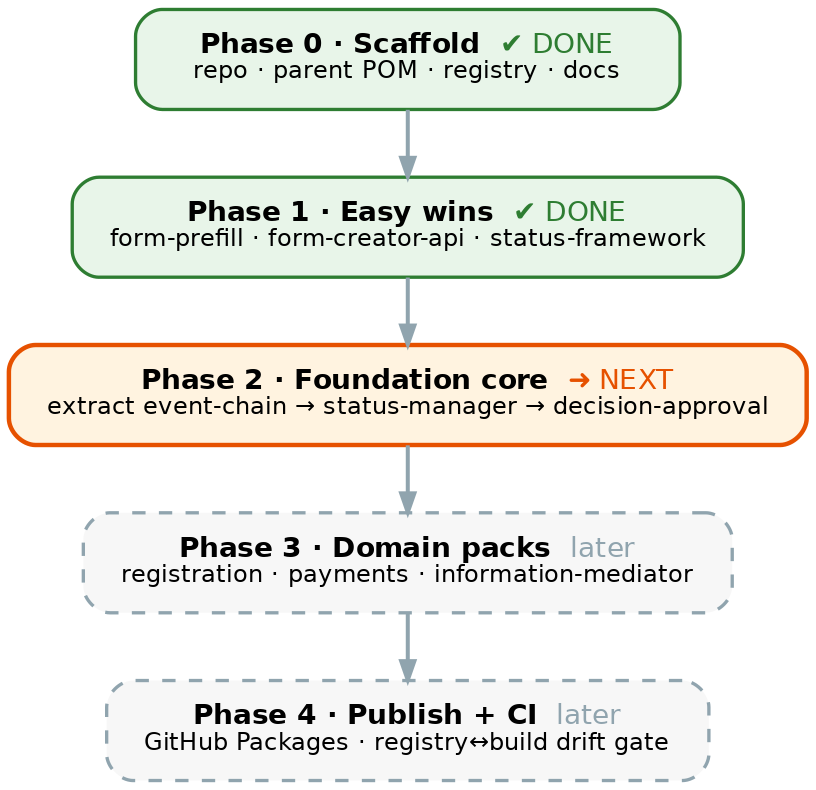

# The Joget Platform-Plugins Vision

**A shared runtime-extension library for spec-to-code-on-Joget development.**
*Why plugins become a platform, what that platform is, and how it works.*

> **The invariant — a plugin here never depends on a consuming project.**
> Projects (and `jkit`) depend on the platform; the arrow only points one way. A plugin that
> imports project code is disqualified until it is genericised.

## Executive summary

Reusable Joget plugins have been built again and again inside individual projects, then copied
when the next project needed them. This document sets out a different model: treat a plugin as an
**extension of the Joget development platform, not a component of any one project**. A single
version-controlled library holds every reusable plugin; projects — and the spec-to-code engine
`jkit` — consume them by pinning a version, never by copying. The library serves *any*
spec-to-code-on-Joget development; GovStack Building Blocks are one lens over it, not its boundary.

## 1. Why — the problem, and the goal

Across three production Joget engagements, reusable plugins ended up scattered across six-plus
homes — separate project folders, a shared-plugins directory, and a monolithic case-management
bundle. Two failure modes followed. **Duplication**: with no single home and no versioning, the
only way to reuse a plugin was to copy its source into the next project, where the two copies then
diverged. And, worse, **trapped capability**: genuinely generic building blocks — an approval
service, a state machine, a hash-chained event log — were built *inside* a case-management
application, so nothing else could reach them without dragging the whole case project along.

That last point is the crux. An approval service is not a case-management feature; it is a
horizontal capability that merely happened to be written in a case app. The scatter is an accident
of where code was first needed, not a statement about what the code is.

The goal is a developer-experience one: give every reusable plugin a single, versioned,
project-neutral home so that reuse becomes **pin a version** — not fork a copy. New capability is
added once, to the platform, and is immediately available to every project and to `jkit`.

## 2. What — the vision

The platform is a single repository, `joget-platform-plugins`, holding reusable Joget OSGi plugins
as versioned artifacts. It sits between the author-time tools that produce Joget applications and
the run-time applications that consume them.

*The platform sits between author-time tooling and run-time apps; every app depends on it by
version pin, and `jkit` generates against its registry.*

The engine `jkit` reads the platform's registry to know which plugins exist and how to configure
them, then generates application artefacts against that contract **without ever compiling the
plugins**. Any number of applications — tax administration, registration, banking, whatever is
next — draw from the same shelf.

### Two tiers: Foundation, and Domain packs

Plugins are organised by **capability**, not by the project they came from:

- **Foundation** — horizontal, domain-agnostic capability that works for any Joget app. This is
  where the three plugins being freed from the case app belong: an approval service, a state
  machine and an integrity log are foundation capabilities, not case-management ones.
- **Domain packs** (`pack:<domain>`) — capability aligned to a domain (`pack:registration`,
  `pack:payments`, …). A pack that maps to a GovStack Building Block also carries a `govstack_bb`
  tag — a tagging overlay, not the organising axis.

*Solid = shipped and active; dashed = planned or being extracted. GovStack BB names tag the packs
that align to one.*

## 3. How — the mechanism

**Promote and pin, never vendor.** Each plugin builds to a versioned OSGi JAR and is published as
an artifact. Projects consume it the way any library is consumed — by declaring a coordinate and
version — so the deploy step drops the pinned JAR into the instance. When a second project needs a
plugin, it is *promoted* into the platform and pinned, never pasted into the second project.
One plugin, one home, many consumers.

**The registry is the single source of truth.** A single `registry.yaml` lists every plugin, its
coordinates, its tier and category, and — most importantly — its **config contract**: the element
and property keys it exposes. That contract is the plugin's public API, and it is exactly what
`jkit` generates against. Because the kit reads the contract rather than the Java, the two
repositories stay decoupled: changing a contract key is a breaking (major) version change; the Java
implementation can evolve freely underneath it.

**Governance keeps it from rotting back into scatter.** Reuse tiers decide fate (generic promoted
as-is; pattern-reusable genericised first; project-specific stays put). A provenance scrub removes
client names before promotion. A CI drift check asserts the registry and the built modules stay in
step. Each plugin has a definition of done: builds green with tests, namespace scrubbed, registry
entry with contract, consuming project re-pointed and its copy retired.

### The roadmap

*Phases 0–1 are complete (three plugins consolidated); Phase 2 — reclaiming the foundation
capabilities trapped in the case app — is next.*

## 4. What this gives us

A new building block no longer starts from a blank generator and a folder of copied plugins. It
starts from a shelf of versioned, contract-documented capabilities that `jkit` already knows how to
wire in. Reuse becomes a one-line version pin; a fix or an improvement is made once and flows to
every consumer on their next bump; and the catalogue is honest because CI keeps it so. The platform
is domain-neutral, so the same shelf serves a tax system, a registration portal, a bank
back-office, or the next GovStack service equally.

## 5. Status and naming

Three plugins are already consolidated and the reactor builds green. Names are confirmed: the
repository is `joget-platform-plugins`, alongside `joget-spec-kit` (`jkit`) and `joget-claude-skills`.

| Plugin | Category | How | State |
|---|---|---|---|
| `joget-form-prefill` | foundation | promoted (module 1) | active · 12 tests |
| `form-creator-api` | foundation | promoted (module 2) | active |
| `joget-status-framework` | foundation | registered in place | active · pinned |
| `joget-event-chain` | foundation | planned — Phase 2 | extracting |
| `joget-status-manager` | foundation | planned — Phase 2 | extracting |
| `joget-decision-approval` | foundation | planned — Phase 2 | extracting |

See [`CONSOLIDATION-PLAN.md`](CONSOLIDATION-PLAN.md) for the full phased plan,
[`MIGRATION-BACKLOG.md`](MIGRATION-BACKLOG.md) for the per-plugin list, and
[`DAS-EXTRACTION-PLAN.md`](DAS-EXTRACTION-PLAN.md) for the approval-service extraction design.

---

*Figures are committed as PNGs under `img/` and regenerate from their Graphviz sources in
`img/src/` (`dot -Tpng -Gdpi=160 img/src/<name>.dot -o img/<name>.png`). Polished DOCX/PDF renders
of this document are published as GitHub Release assets, not committed to the tree.*
